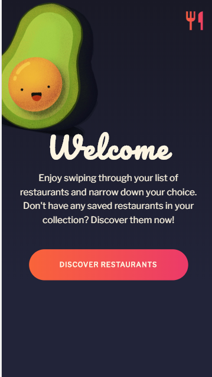
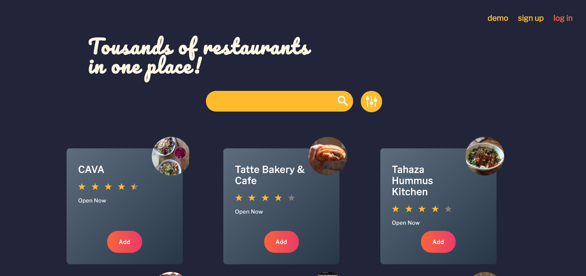
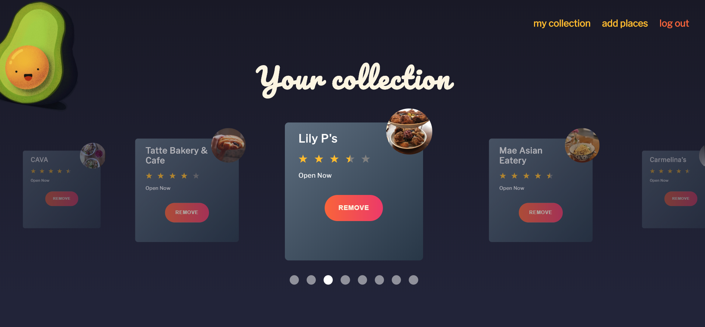
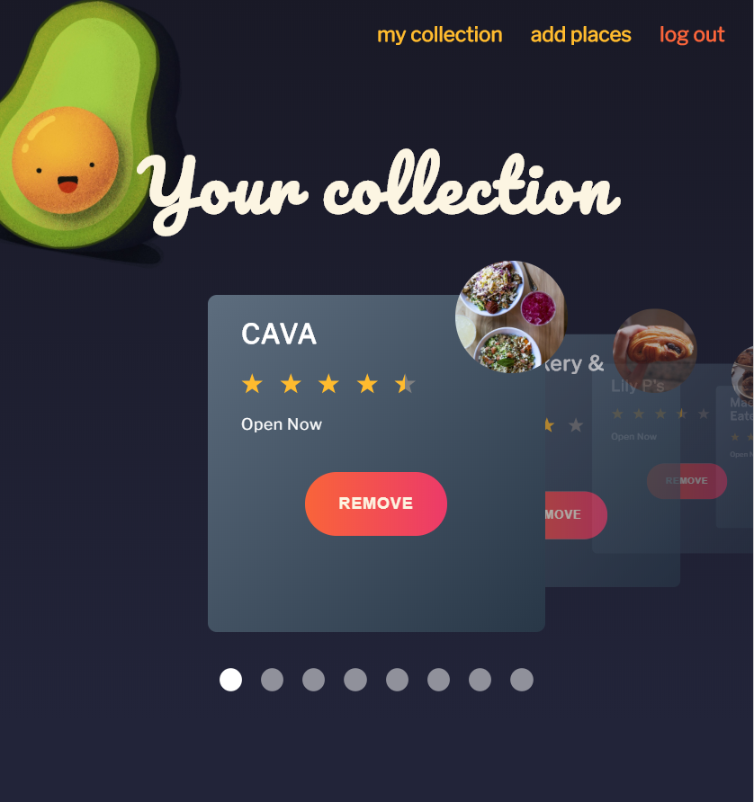

# Where-To-Eat

## Live: [Where To Eat](https://where-to-eat.now.sh/)

## Description:
Craving something yummy, don't feel like experimenting, and nothing comes to your mind? Let Where To Eat to help you to solve this once for all. Design a portfolio of your preferred eateries & fast food joints and have fun swapping through your fav spots and narrow down your options!

## In action:

### Landing Page

### Search Places in your area

 
### Decide to Sign up

### Swipe left and right through your fav spots! 

## Tech Used:
* Yelp API
* Geolocation
* ReactJS
* React Router
* JSX
* NodeJS / ExpressJS
* Postgres / SQL
* HTML
* CSS
